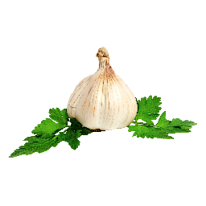

# Garlic
Garlic is an experimental language runtime (like JVM or CLR) written in Rust.

## Project Stucture
* `spec/`: Contains the specifications for the Garlic runtime.
* `src/`: Contains the source code for the Garlic executable.
* `crates/`: Contains subprojects that are required to build Garlic.

## License
Garlic is licensed under the [MIT License](https://opensource.org/license/mit/).
See the [LICENSE](LICENSE) file for more details.